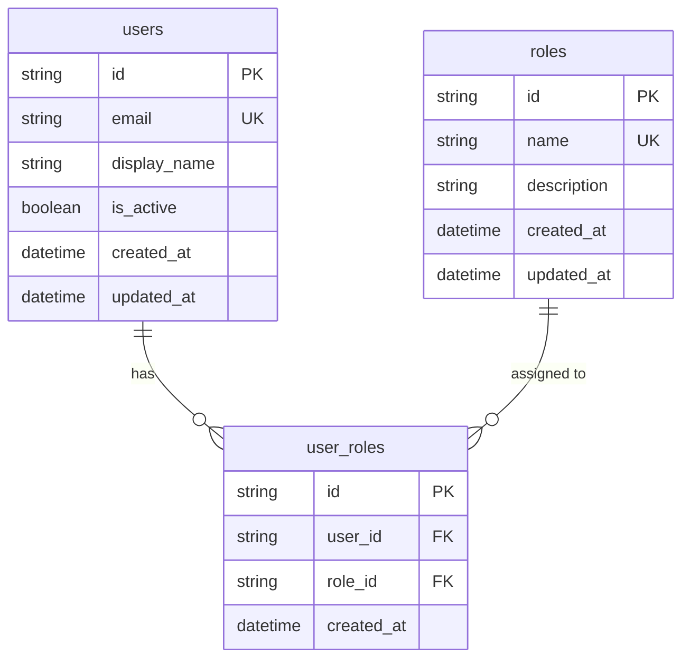

# M8 Identity Domain Architecture

This document outlines the foundation of the identity domain implemented in Milestone M8.1.

## Architecture

The identity domain establishes three core entities utilizing SQLAlchemy 2 async definitions:

- **User**: The primary actor entity representing individuals accessing the system.
- **Role**: Defined system roles based on strict enum values.
- **UserRole**: An associative entity mapping Users to Roles.

## Initial Roles

The system uses a strict vocabulary for role assignment to support future RBAC definitions:
- **`OPERATOR`**: Operational/read/investigation-oriented user. Cannot automatically be assumed to approve financial actions.
- **`FINANCE_MANAGER`**: Authorized finance workflow user. Intended future role for approval-sensitive operations.
- **`ADMIN`**: Administrative/platform management role.

## Security Constraints and Clarifications

> [!WARNING]
> **Authentication is NOT implemented in M8.1.**
> There is no capability for login, JWT tokens, session cookies, or password handling.
> Passwords are explicitly **NOT** stored in M8.1. Authentication is reserved for M8.2.

> [!WARNING]
> **Authorization is NOT enforced in M8.1.**
> RBAC (Role-Based Access Control) enforcement belongs to later M8 milestones. The roles are defined and seeded purely as structural foundations.

> [!IMPORTANT]
> The identity models are decoupled from core financial facts (Payments, Settlements), the AI Investigation agent (Gemini), and the ActionExecution execution adapters. They are an independent foundational domain.

## Future Audit Compatibility

The existing `ActionRequestAudit` and `ActionRequest` models contain an `actor` field stored as a `String`. 
In future milestones (e.g., M8.3), this field may be migrated to a direct Foreign Key referencing `users.id` or populated with validated `user.display_name` via the authenticated session context. The core architecture ensures `User` will be available as a first-class entity for these future audit requirements.
